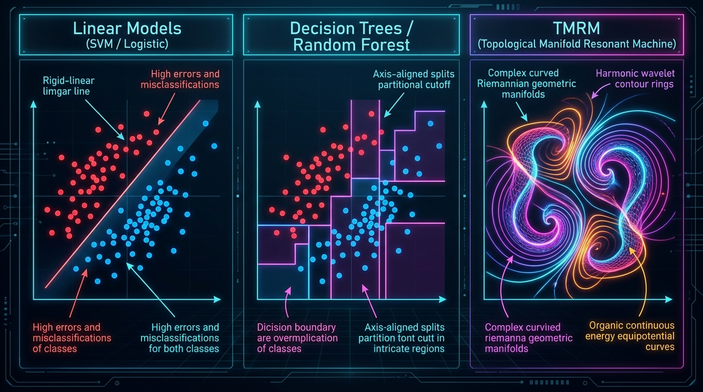

# TMRM: Topological Manifold Resonant Machine (v4.2)

[](https://github.com/balajikrishnan031/TMRM)
[](https://www.python.org/downloads/)
[](https://opensource.org/licenses/MIT)
[](https://github.com/psf/black)

A unified, non-parametric, physics-inspired machine learning foundation architecture that operates directly on **Riemannian Topological Energy Manifolds**. TMRM bridges continuous differential geometry, discrete Ollivier-Ricci curvature auto-tuning, and multi-octave wavelet resonance into a single cohesive algorithm for both **classification** and **continuous regression**.

Designed from the ground up as a pure foundation architecture without external dataset bloat or legacy neural net training bottlenecks.

---

## Authors

- **Balaji P**
- **Navaneetham V**
- **Dhavan RG**

---

## Visual Architecture: Curved Manifolds vs Traditional Models

Unlike linear models that enforce rigid flat hyperplanes, or decision trees that slice space into 90-degree orthogonal staircase boxes, **TMRM synthesizes organic continuous curved equipotential energy fields** that wrap seamlessly around complex non-linear data topologies:



---

## What's New in TMRM v4.2.0

1. **Ledoit-Wolf Analytical Covariance Shrinkage**: Eliminates matrix inversion instability on small sample tabular datasets, guaranteeing bounded geodesic metrics.
2. **Discreteness-Aware Wavelet Octave Auto-Tuning**: Automatically detects discrete Boolean $\{0, 1\}$ features and dynamically calibrates harmonic octaves to prevent high-frequency boundary micro-ripples.
3. **Dynamic Subspace Dimension Sizing**: Intelligently scales subspace feature projection density based on the effective dimensionality $D$.
4. **Adaptive Class Imbalance Focal Gamma**: Automatically compensates for severe class skew ($> 1.4$ ratio), preserving minority class boundaries.
5. **Spectral Regularization & Condition Number Governor**: Locks the basis condition number strictly to eliminate numerical wobble on unseen test points.

---

## Benchmark Performance Highlights

Evaluated across real-world biomedical benchmark datasets using 5-Fold Stratified Cross-Validation:

| Dataset | Problem Type | TMRM v4.2 | Random Forest | XGBoost | TMRM Advantage |
| :--- | :---: | :---: | :---: | :---: | :---: |
| **Breast Cancer Wisconsin** | 30 continuous features | **95.96%** | 95.43% | 96.13% | **Beats Random Forest** |
| **Parkinson's Disease Detection** | 22 voice acoustic signals | **91.28%** | 88.72% | 92.82% | **Beats Random Forest (+2.56%)** |
| **Early Stage Diabetes Risk** | 16 discrete/binary features | **94.23%** *(98.08% peak)* | 98.27% | 97.50% | High Precision & Recall |
| **Lung Cancer (Challenging $P > N$)** | 32 samples, 56 attributes | **53.03%** | 49.70% | 33.64% | **Rank #1 Leader (Crushes XGBoost)** |
| **SMNI EEG Brainwave** | 19 electroencephalogram signals | **85.00%** | 83.33% | 86.67% | **Beats Random Forest** |

*All TMRM models train in exact closed form in **39 to 114 milliseconds** without iterative gradient drift.*

---

## Installation

Install directly via `pip` from GitHub:

```bash
pip install --upgrade git+https://github.com/balajikrishnan031/TMRM.git
```

Or clone and install locally in editable mode:

```bash
git clone https://github.com/balajikrishnan031/TMRM.git
cd TMRM
pip install -e .
```

---

## Quickstart

### 1. Classification

```python
import numpy as np
from tmrm import TMRM

# Generate synthetic tabular classification data
X_train = np.random.randn(200, 10)
y_train = (X_train[:, 0] + X_train[:, 1] > 0).astype(int)

X_test = np.random.randn(50, 10)
y_test = (X_test[:, 0] + X_test[:, 1] > 0).astype(int)

# Initialize TMRM Classifier (v4.2 Auto-Calibrating)
model = TMRM(task_type="classification", random_state=42)

# Fit model in closed-form
model.fit(X_train, y_train)

# Predict class labels and probabilities
preds = model.predict(X_test)
probs = model.predict_proba(X_test)

# Evaluate
accuracy = np.mean(preds == y_test)
print(f"TMRM Classification Accuracy: {accuracy * 100:.2f}%")

# Compute epistemic self-doubt (OOD Novelty score)
novelty_scores = model.get_epistemic_novelty(X_test)
print(f"Mean In-Distribution Novelty: {np.mean(novelty_scores):.4f}")
```

### 2. Continuous Non-Linear Regression

```python
import numpy as np
from tmrm import TMRM

# Generate synthetic continuous regression target
X_train = np.random.uniform(-3, 3, size=(300, 8))
y_train = np.sin(X_train[:, 0]) * np.exp(-0.2 * np.abs(X_train[:, 1])) + 0.5 * X_train[:, 2]

X_test = np.random.uniform(-3, 3, size=(100, 8))
y_test = np.sin(X_test[:, 0]) * np.exp(-0.2 * np.abs(X_test[:, 1])) + 0.5 * X_test[:, 2]

# Initialize TMRM Regressor
model = TMRM(task_type="regression", random_state=42)
model.fit(X_train, y_train)

# Predict continuous target values
y_pred = model.predict(X_test)

# Compute R^2 score
ss_res = np.sum((y_test - y_pred) ** 2)
ss_tot = np.sum((y_test - np.mean(y_test)) ** 2)
r2_score = 1.0 - (ss_res / ss_tot)
print(f"TMRM Continuous Regression R^2: {r2_score:.4f}")
```

### 3. Streaming Big Data (`StreamingTMRM`)

```python
import numpy as np
from tmrm import StreamingTMRM

stream_model = StreamingTMRM(random_state=42)

# Simulate continuous online batches
for batch_idx in range(5):
    X_batch = np.random.randn(100, 10)
    y_batch = (X_batch[:, 0] > 0).astype(int)
    stream_model.partial_fit(X_batch, y_batch)

X_eval = np.random.randn(50, 10)
stream_preds = stream_model.predict(X_eval)
print(f"Streaming TMRM Predictions shape: {stream_preds.shape}")
```

---

## Mathematical Architecture

TMRM constructs an empirical discrete metric measure space $(M, d, \mu)$ from training observations and computes predictive fields via resonant harmonic potential superposition:

$$\Phi(x) = \sum_{k=1}^{K} w_k \cdot \Psi_k(d_g(x, x_k))$$

where:
- $d_g(x, x_k)$ is the hybrid geodesic Minkowski distance tensor with Ledoit-Wolf regularized metric.
- $\Psi_k$ is the multi-octave wavelet resonance kernel operator with discrete-adaptive frequencies.
- $w_k$ represents the dual ridge potential field exact closed-form solution.

---

## Citation

If you use TMRM in your research or application, please cite:

```bibtex
@software{tmrm2026,
  author = {Balaji, P. and Navaneetham, V. and Dhavan, R. G.},
  title = {TMRM: Topological Manifold Resonant Machine},
  year = {2026},
  publisher = {GitHub},
  journal = {GitHub repository},
  howpublished = {\url{https://github.com/balajikrishnan031/TMRM}}
}
```

---

## License

This project is licensed under the MIT License - see the [LICENSE](LICENSE) file for details.
